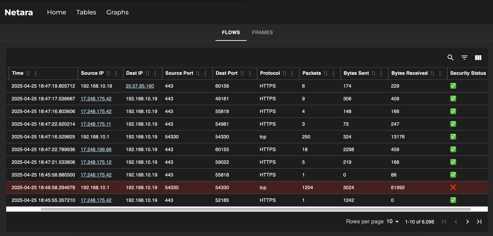
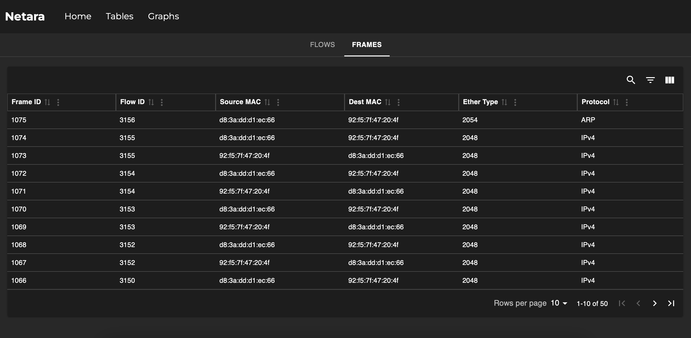
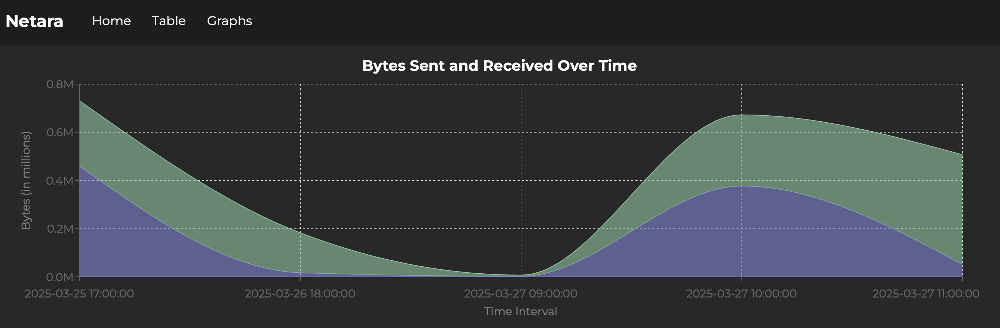
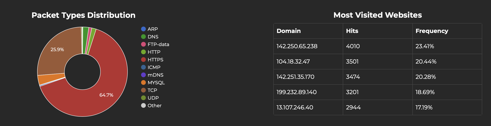
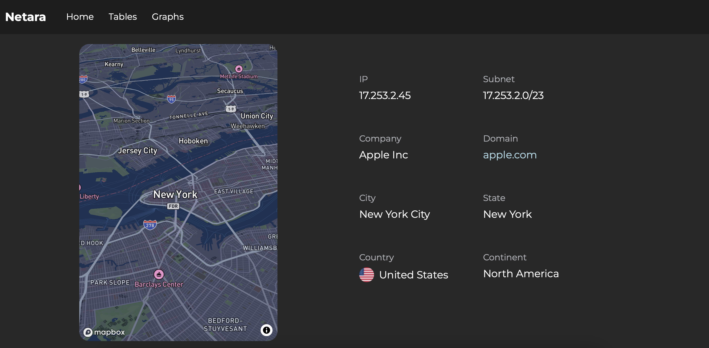

# Netara (Capstone Project)

A machine learning network analyzer that monitors real-time traffic and detects malicious activity in network flows.

## Key Features

### Tables
The Flows Table displays individual network flows and their corresponding information, including IP addresses, port numbers, and more. Rows highlighted in red indicate detected malicious activity. <br>



The Frames Table displays Layer 2 (Frame) data from each packet within a given flow, including source and destination MAC addresses, Ether Type, and Protocol. <br>



### Graphs
The first graph displays the volume of data sent and received over the last five time intervals, measured in bytes. <br>



The following two graphs illustrate the most frequently used network protocols and the most commonly visited websites. <br>



### Geolocation
The Geolocation page displays geolocation data for a given IP address, in this case, one of Apple’s servers. On the left, a map created using Mapbox pinpoints the server’s physical location. On the right, detailed geolocation information is provided. <br>



## Project Structure
- **Frontend** (`/frontend`)
    - React-based dashboard with Material-UI and custom designed components
    - Interactive data visualizations using React Google Charts and Recharts
    - Mapbox GL integration for geographic traffic analysis
    - Real-time network flow monitoring

- **Backend** (`/backend`)
    - Python Flask API server
    - Network traffic capture and analysis via Python Scapy
    - Machine learning models for threat detection
        - 3 anomaly detection models (IsolationForest, KNearestNeighbors, and LocalOutlierFactor)
        - 1 binary classifier model (RandomForestClassifier)
    - MariaDB database for network flow, packet, and frame storage
    - Custom Python scripts for network attacks, including Denial of Service and Port Scanning
    - IPData API for Geolocation services

## Technology Stack

### Frontend
- React
- Material-UI
- Mapbox GL
- Node.js
- React Google Charts
- Recharts

### Backend
- Python
- Scapy
- Flask
- MariaDB
- Pandas
- Scikit-Learn
- IPData API

## Getting Started

### Backend Setup

1. Navigate to the backend folder
```sh
cd backend
```

2. Create a Python virtual environment
```sh
python -m venv myenv
```

3. Activate the virtual environment
```sh
source myenv/bin/activate
```

4. Install the necessary packages
```sh
pip install -r requirements.txt
```

5. Run the python server, which hosts the Flask APIs
```sh
python server.py
```

### Frontend Setup

1. Navigate to the frontend folder
```sh
cd frontend
```

2. Install the necessary packages
```sh
npm install
```

3. Start the frontend server
```sh
npm start
```
The application will be available at http://localhost:3000